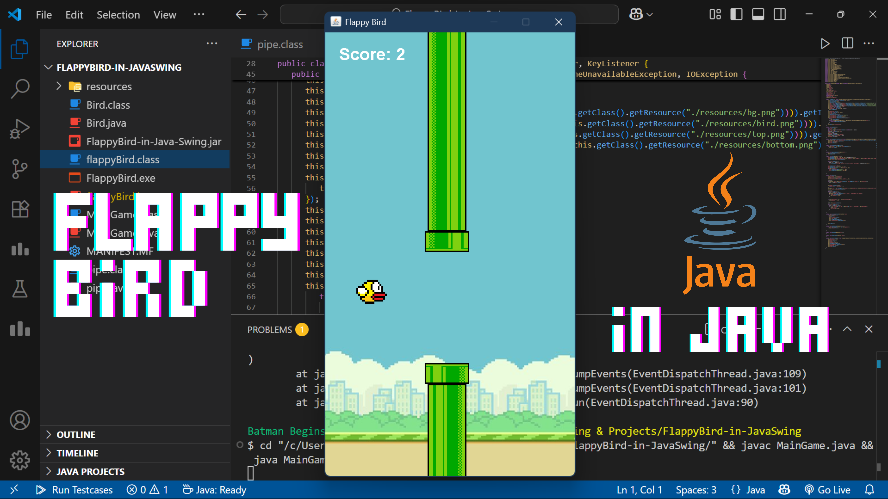
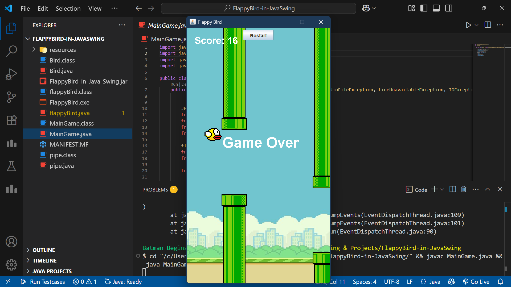
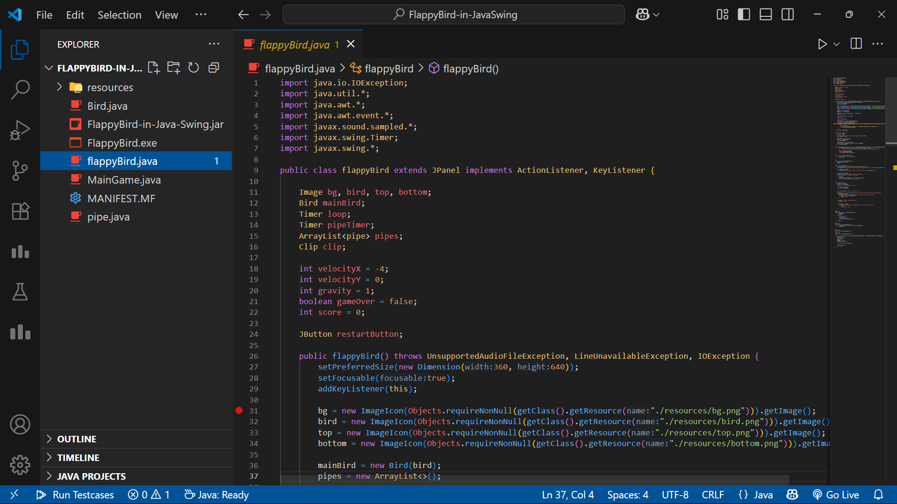
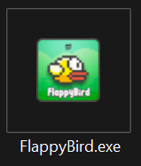

# 🐦 Flappy Bird Java

<div align="center">


**A classic Flappy Bird game recreation built with Java Swing**

[🎮 Getting Started](#-getting-started) • [🎯 How to Play](#-how-to-play) • [🛠️ Installation](#️-installation)

</div>

---



---

## 🎯 About This Project

This is a faithful recreation of the classic Flappy Bird game built entirely in Java using Swing. The project demonstrates core Java programming concepts including GUI development, event handling, collision detection, and audio integration.

Perfect for students learning Java or anyone interested in simple game development!

---

## ✨ Features

- **Classic Flappy Bird gameplay** with smooth animations
- **Background music** that plays during the game
- **Real-time score tracking** displayed on screen
- **Collision detection** between bird and pipes
- **Game over screen** with restart functionality
- **Responsive controls** using spacebar input
- **Automatic pipe generation** at timed intervals

---

## 🎮 How to Play

- **Press `SPACEBAR`** to make the bird jump
- **Avoid the pipes** by navigating through the gaps
- **Score points** by successfully passing through pipes
- **Game over** when the bird hits a pipe or the ground
- **Click "Restart"** button to play again

---

## 🛠️ Installation

### Prerequisites
- Java JDK 8 or higher
- Any Java IDE (IntelliJ IDEA, Eclipse, VS Code, etc.)

### Setup Instructions

1. **Clone or download** this repository
2. **Create a `resources` folder** in your project directory
3. **Add the following files** to the `resources` folder:
   - `bg.png` - Background image
   - `bird.png` - Bird sprite
   - `top.png` - Top pipe image
   - `bottom.png` - Bottom pipe image
   - `bg_music.wav` - Background music file

4. **Choose your preferred method**:
   - **Easy**: Download the `.exe` file from releases
   - **JAR**: Download and run the `.jar` file
   - **Source**: Compile and run from source code

### Project Structure
```
flappy-bird-java/
├── MainGame.java      # Main entry point
├── flappyBird.java    # Game logic and rendering
├── Bird.java          # Bird object class
├── pipe.java          # Pipe object class
├── MANIFEST.MF        # JAR manifest file
├── FlappyBird.jar     # Compiled JAR file
├── FlappyBird.exe     # Windows executable
└── resources/
    ├── bg.png         # Background image
    ├── bird.png       # Bird sprite
    ├── top.png        # Top pipe sprite
    ├── bottom.png     # Bottom pipe sprite
    └── bg_music.wav   # Background music
```

---

## 🧩 Code Structure

### Main Classes

| Class | Description |
|-------|-------------|
| `MainGame` | Entry point that creates the JFrame window |
| `flappyBird` | Main game panel with all game logic |
| `Bird` | Bird object with position and image properties |
| `pipe` | Pipe object with collision detection |

### Key Java Concepts Used

- **JFrame & JPanel** - Window and game area
- **ArrayList** - Dynamic pipe storage
- **Timer** - Game loop and pipe spawning
- **KeyListener** - Keyboard input handling
- **Graphics2D** - Custom drawing and rendering
- **Java Sound API** - Background music playback
- **Rectangle** - Collision detection
- **ActionListener** - Button and timer events

---

## 🎨 Game Mechanics

### Physics
- **Gravity**: Bird falls continuously
- **Jump**: Spacebar applies upward velocity
- **Collision**: Game ends when bird touches pipes or ground

### Scoring
- **+1 point** for each pipe successfully passed
- Score displayed in real-time at top-left corner

### Pipe Generation
- New pipes spawn every 1.5 seconds
- Random height variation for difficulty
- 160-pixel gap between top and bottom pipes

---

## 🔧 Technical Details

### Window Settings
- **Size**: 360x640 pixels
- **Fixed size** (not resizable)
- **Centered** on screen

### Game Loop
- **60 FPS** refresh rate
- Continuous movement and collision checking
- Automatic pipe cleanup when off-screen

### Audio
- Background music loops continuously
- Stops when game ends
- Restarts with new game

---

## 📸 Screenshot




---

## 🚀 Running the Game

### Option 1: Download Executable (Recommended)
**🎮 Ready to play immediately!**


[](https://github.com/najibnahindev/FlappyBird-in-JavaSwing/raw/main/FlappyBird.exe)

- **One-click download** - No Java installation required
- **Portable** - Run directly without installation
- **Windows compatible** - Works on Windows 7, 8, 10, 11

### Option 2: Run JAR File
```bash
# Download the JAR file from releases
java -jar FlappyBird.jar
```

### Option 3: Compile from Source
```bash
# Compile
javac *.java

# Run
java MainGame
```

---

## 🎯 Learning Outcomes

This project helped me learn:
- **Java Swing** GUI development
- **Game loop** implementation
- **Event handling** and user input
- **Object-oriented programming** principles
- **Audio integration** in Java
- **Collision detection** algorithms
- **Resource management**
- **JAR file creation** and packaging
- **Executable creation** using Launch4j Wrapper
- **Application deployment** and distribution

---

## 🤝 Contributing

Feel free to fork this project and submit pull requests for improvements!

---

## 📄 License

This project is open source and available under the MIT License.

---

<div align="center">

---

If you like this project, don't forget to ⭐ **star** the repo!

</div>
